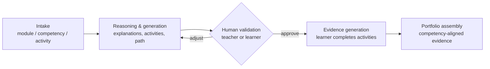
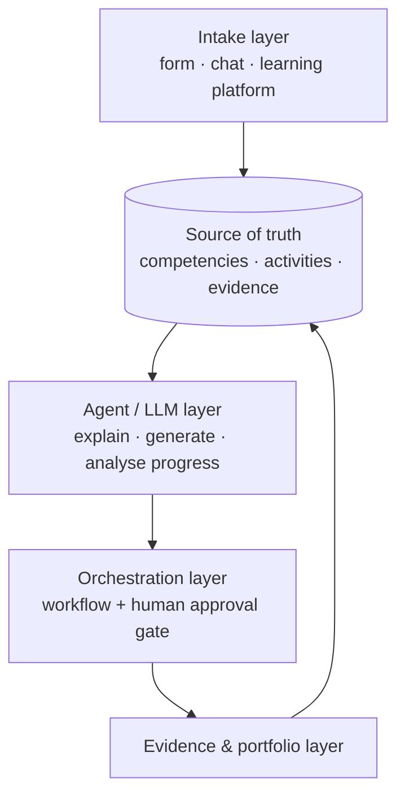

# Diagrams

## Conceptual flow

```mermaid
flowchart LR
    A[Intake<br/>module / competency / activity] --> B[Reasoning & generation<br/>explanations, activities, path]
    B --> C{Human validation<br/>teacher or learner}
    C -- adjust --> B
    C -- approve --> D[Evidence generation<br/>learner completes activities]
    D --> E[Portfolio assembly<br/>competency-aligned evidence]
```

## Conceptual architecture

```mermaid
flowchart TB
    I[Intake layer<br/>form · chat · learning platform] --> S[(Source of truth<br/>competencies · activities · evidence)]
    S --> L[Agent / LLM layer<br/>explain · generate · analyse progress]
    L --> O[Orchestration layer<br/>workflow + human approval gate]
    O --> P[Evidence & portfolio layer]
    P --> S
```
